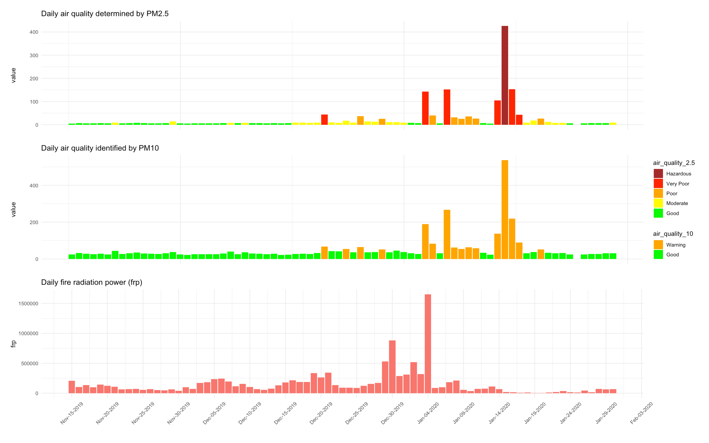

```{r setup, include=FALSE}
options(htmltools.dir.version = FALSE)
knitr::opts_chunk$set(echo = TRUE, message = FALSE, warning = FALSE)
library(xaringanExtra)
library(xaringanthemer)
library(dplyr)
library(lubridate)
library(naniar)
library(ggplot2)
library(patchwork)
library(leaflet)
library(kableExtra)
```

```{r xaringan-themer, include=FALSE, warning=FALSE}
library(xaringanthemer)
style_duo_accent(
  primary_color = "#1381B0",
  secondary_color = "#FF961C",
  inverse_header_color = "#FFFFFF",
  title_slide_text_color = "#FFFFFF"
)
```

```{css, echo = FALSE}
table-head {
  font-size: 10px;     
}

.left-align {
  width: 60%;
  height: 92%;
  float: left;
}
.right-align {
  width: 38%;
  float: right;
  padding-left: 2%;
}
```

# What is the air quality today?

```{r EPA-live, echo = TRUE, message=FALSE,warning=FALSE, echo=FALSE,}
knitr::include_url("https://www.epa.vic.gov.au/EPAAirWatch")
```

Source: [Environment Protection Authority Victoria](https://www.epa.vic.gov.au/EPAAirWatch)

---
class: center, middle

# Studied questions
--

### Is there evidence to suggest that the air quality in Melbourne decreased during the summer bush fire season?

--
### and
--

### How does air quality compare now?

---
class: center, middle

# When is the bush fire season?
#### The **"Australian Bush Fire season"** started in Victoria from 21 November 2019. All significant fires in Victoria were declared contained on 27 February 2020. <sup> 1 </sup>
#### By 31 March 2020, the bush fire season is considered ended <sup> 2 </sup>

.footnote[
[1] Source: https://en.wikipedia.org/wiki/2019%E2%80%9320_Australian_bushfire_season#Victoria  
[2] Source: https://www.aljazeera.com/news/2020/3/31/australias-devastating-bushfire-season-comes-to-an-end
]


---
class: center, middle

# Data set

---
class:table-head

## Dataset used

```{r xaringan-panelset, echo=FALSE} 
xaringanExtra::use_panelset() 
```

```{r read-data, include = FALSE, echo=TRUE}
sensor_location <- read.csv(here::here("data", "Microclimate_Sensor_Locations.csv"))
sensor_reading <- read.csv(here::here("data", "Microclimate_Sensor_Readings.csv"))
type_metadata <- read.csv(here::here("data", "type_metadata.csv"))
fire_archive <- read.csv(here::here("data", "fire_archive_V1_101674.csv")) %>%
  select(latitude, longitude, acq_date, frp)
fire_nrt <- read.csv(here::here("data", "fire_nrt_V1_101674.csv")) %>%
  select(latitude, longitude, acq_date, frp)

# Clean
sensor_reading <- sensor_reading %>%
  # Change from factor to date time
  mutate(local_time = ymd_hms(local_time, tz = "UTC"),
  # Change some factors to character type
         type = as.character(type),
         units = as.character(units))

# Merge with sensor location
sensor_reading_location <- sensor_reading %>%
  left_join(sensor_location, by = "site_id")

# fire location merged
fire_location <- rbind(fire_archive, fire_nrt)
# reformat and choose days that matched with sensor data
fire_location <- fire_location %>%
  mutate(acq_date = ymd(acq_date)) %>%
  filter(acq_date > "2019-11-14")
```

.left-align[
.panelset[
.panel[.panel-name[Reading]
```{r read-sensor-reading, echo = FALSE}
reading_structure <- tribble(~Variable, ~Description,
                             "id", "Unique id for each record in the dataset",
                             "site_id", "Location id",
                             "sensor_id", "Sensor id",
                             "value", "Value of reading",
                             "local_time", "Local date and time",
                             "type", "Type of sensor",
                             "units", "Units of measurement")
knitr::kable(head(reading_structure), format = 'html')
```

]

.panel[.panel-name[Location]
```{r read-sensor-location, echo = FALSE}
knitr::kable(head(sensor_location,3), format = 'html')
```
]

.panel[.panel-name[NASA]
```{r read-fire-location, echo = FALSE}
knitr::kable(head(fire_location,5), format = 'html')
```

]

]]

.right-align[
**Source**
- Microclimate Sensor Readings from [Open data gate - City of Melbourne](https://data.melbourne.vic.gov.au/Environment/Microclimate-Sensor-Readings/u4vh-84j8?src=featured_banner)
- Microclimate Sensor Locations from [Open data gate - City of Melbourne](https://data.melbourne.vic.gov.au/Environment/Microclimate-Sensor-Locations/irqv-hjr4)
- Australian Bush fire satellite data from [NASA](https://earthdata.nasa.gov/firms)

**Note**
- Data provided from sensor reading runs from `r as.Date(min(sensor_reading_location$local_time), format = "%d-%B-%y")` to `r as.Date(max(sensor_reading_location$local_time), format = "%d-%B-%y")`
- Data provided from NASA fire satellite runs from `r min(fire_location$acq_date)` to `r max(fire_location$acq_date)`
]
---
## What types to use?
> EPA monitors the quality of air in Victoria. We do this by measuring the air for pollutants that can affect human health. We measure for several common pollutants such as particles (PM2.5 and PM10), ozone and nitrogen dioxide. 
_(EPA Victoria)_

.pull-left[
```{r read-type, echo = FALSE}
type_metadata %>%
  select(-Type.) %>%
  knitr::kable(format = 'html') %>%
  row_spec(c(4,6), background = "yellow") %>%
  kable_styling(font_size = 7)
```
]

--
```{r check-error-prep, echo = TRUE, include=FALSE}
# Check the errorneous in reading
test1 <- sensor_reading %>%
  left_join(sensor_location, by = "site_id") %>%
  filter(sensor_id %in% c("0a.EPA-1h.PKIND", "0b.EPA-1h.PKIND"))

check_error <- test1 %>%
  filter(value == 0) %>%
  group_by(local_time) %>%
  count(value) %>%
  rename(count = n) %>%
  arrange(local_time)
```

.pull-right[
- There is a total of `r nrow(test1)` observations for the two types: `0a.EPA-1h.PKIND` and `0b.EPA-1h.PKIND`.
- We only have 7 readings that had low confidence in reading (14 for both types) as below:

.left[
```{r check-error, echo = FALSE, message=FALSE, warning = FALSE, fig.align="left"}
knitr::kable(check_error,format = 'html') %>%
  kable_styling(font_size = 8)
```
]
- The erroneous readings were minimal -> We are happy with using the full set.
]

---
## Can we trust the data?
```{r clean-reading-location, include = FALSE, echo=TRUE}
# Choose the selected sensor_id
select_sensor <- c("0a.EPA-1h", "0a.EPA-24h", "0b.EPA-1h", "0b.EPA-24h")

sensor_reading_location <- sensor_reading_location %>%
  filter(sensor_id %in% select_sensor) %>%
  select(-last_data,-location, -units, -description) %>%
  mutate(time = strftime(local_time, format="%H:%M:%S", tz = "UTC"),
         day = day(local_time),
         month = month(local_time, abbr = TRUE),
         year = year(local_time)) %>%
  group_by(site_id, year, month) %>%
  arrange(local_time)
  
# Daily pm2.5 24 hour average = pm2.5 at the latest of a day. 
daily_pm_2.5 <- sensor_reading_location %>%
  filter(sensor_id == "0a.EPA-24h") %>%
  filter(time == max(time))
```

.pull-left[
.panelset[
.panel[.panel-name[vismiss]
```{r missing-check,echo = FALSE, message= FALSE, warning= FALSE, fig.retina=4}
vis_miss(sensor_reading_location, warn_large_data = FALSE)
```
]
.panel[.panel-name[daycheck]
```{r check-missing, echo = FALSE, message= FALSE, warning= FALSE, fig.retina=4, fig.height=6}
# check only the type of sensor used
check_sensor <- c("0a.EPA-24h","0b.EPA-24h")

sensor_reading_location %>%
  filter(sensor_id %in% check_sensor) %>%
  group_by(local_time) %>%
  ggplot(aes(x = local_time, y = value)) +
  geom_bar(stat = "identity",fill = "orange") +
  facet_wrap(~site_id)+
  theme(legend.position = "none",
        axis.text.x = element_text(angle = 45, vjust = 0.5)) +
  theme_minimal()
```

]
]]

.pull-right[
**Note**

- Using vismiss is not enough to identify the missing values.
- We visualise the reading for all of the days in the dataset for each sensor 
  - Not all sensors have full data recorded.
  - In **24th January 2020**, there is no data recorded for all of the sensors.
- The overall pattern of all the sensors appreared similar -> average all sensors to account for daily reading.
]
---
class: center, middle

# Let's start digging

---
## Daily level of PM 2.5

.pull-left[
```{r daily-pm2.5-plot-prep, include = FALSE, echo=TRUE}
# obtain daily average regardless of site_id
daily_avg_pm_2.5 <- daily_pm_2.5 %>%
  group_by(local_time) %>%
  summarise_at(vars(value), funs(mean(., na.rm=TRUE))) %>%
  mutate(air_quality_2.5 = case_when(
    value < 8 ~ "Good",
    value >=8 & value < 25 ~ "Moderate",
    value >=25 & value < 40 ~ "Poor",
    value >=40 & value < 177 ~ "Very Poor",
    TRUE ~ "Hazardous"))

# create colour palette
quality_colour <- tibble(
  air_quality_2.5 = c("Good", "Moderate", "Poor", "Very Poor", "Hazardous"),
  Color = c("green", "yellow", "orange", "red", "brown"))

# assign colour to each quality
daily_avg_pm_2.5$air_quality_2.5 <- factor(daily_avg_pm_2.5$air_quality_2.5, levels = quality_colour$air_quality_2.5)
```

```{r daily-pm2.5-plot, echo = FALSE, message= FALSE, warning= FALSE, fig.retina=4}
# plot
daily_avg_pm_2.5 %>%
  ggplot(aes(x = local_time, y = value, fill = air_quality_2.5)) +
  geom_bar(stat = "identity") +
  scale_fill_manual(values = quality_colour$Color) +
  theme_minimal() +
  scale_x_datetime(date_breaks = "1 month", date_labels = "%b-%Y") +
  theme(axis.text.x = element_text(angle = 90, vjust = 0.5)) +
  ggtitle("Daily air quality identified by PM2.5") +
  xlab("Day")
```
]
--
.pull-right[
.panelset[
.panel[.panel-name[Standard]
```{r air-standard, warning = FALSE, message=FALSE, echo = FALSE}
knitr::include_graphics(here::here("images","standard-2.5.png"))
```
]
.panel[.panel-name[Findings]
- In most of the days, Melbourne has good air quality.  
- From mid-December 2019 to early Feb 2020, air quality dropped drastically with January being the worst month. Only half the days having the "Good" and "Moderate" air quality, the rest were "Poor" and "Very poor" with 1 "Hazardous" day.
```{r AQ-count-2.5,include = FALSE, echo=TRUE}
day_count_2.5 <- daily_avg_pm_2.5 %>%
  mutate(day = day(local_time),
         month = month(local_time, abbr = TRUE),
         year = year(local_time)) %>%
  group_by(year, month) %>%
  count(air_quality_2.5)
day_count_2.5
```
- One day in July had "poor" quality.
]
]]
---
## Daily level of PM 10
.pull-left[
```{r daily-avg-10, include = FALSE, echo=TRUE}
# Daily pm10 24 hour average = pm10 at the latest of a day. 
daily_pm_10 <- sensor_reading_location %>%
  filter(sensor_id == "0b.EPA-24h") %>%
  mutate(air_quality = case_when(
    value < 50 ~ "Good",
    TRUE ~ "Warning")) %>%
  filter(time == max(time))
```

```{r daily-pm10-plot-prep, include = FALSE, echo=TRUE}
# obtain daily average regardless of site_id
daily_avg_pm_10 <- daily_pm_10 %>%
  group_by(local_time) %>%
  summarise_at(vars(value), funs(mean(., na.rm=TRUE))) %>%
  mutate(air_quality_10 = case_when(
    value < 50 ~ "Good",
    TRUE ~ "Warning"))

# create colour palette
quality_colour_pm10 <- tibble(
  air_quality = c("Good", "Warning"),
  Color = c("green", "orange"))

# assign colour to each quality
daily_avg_pm_10$air_quality_10 <- factor(daily_avg_pm_10$air_quality_10, levels = quality_colour_pm10$air_quality)
```

```{r daily-pm10-plot, echo = FALSE, message= FALSE, warning= FALSE, fig.retina=4}
# plot
daily_avg_pm_10 %>%
  ggplot(aes(x = local_time, y = value, fill = air_quality_10)) +
  geom_bar(stat = "identity") +
  scale_fill_manual(values = quality_colour_pm10$Color) +
  theme_minimal() +
  scale_x_datetime(date_breaks = "1 month", date_labels = "%b-%Y") +
  theme(axis.text.x = element_text(angle = 90, vjust = 0.5)) +
  ggtitle("Daily air quality identified by PM10") +
  xlab("Day")
```
]

.pull-right[
.panelset[
.panel[.panel-name[Standard]
```{r air-standard-10, warning = FALSE, message=FALSE, echo = FALSE}
knitr::include_graphics(here::here("images","standard-10.png"))
```

- There is currently no standard for rolling averaged 24-hour PM10. Instead a warning will be triggered when the level reached 50 µg/m3.
- In this chart, we also set 50µg/m3 as a threshold to trigger the "Warning" notice.

]

.panel[.panel-name[Findings]
- Similar to PM 2.5, the PM10 had the same period where the air quality wasdropped terribly.
- January again had some days that the air quality was terrible with an exeptionally high level of PM10.


]
]]
---
## What about fire occurrence?
```{r fire-locate, include = FALSE, echo=TRUE}
day_frp <- fire_location %>% 
  group_by(acq_date) %>%
  summarise_at(vars(frp), funs(sum(., na.rm=TRUE))) %>%
  arrange(acq_date)
```

```{r combined-plot-prep, include = FALSE, echo=TRUE}
p1 <- daily_avg_pm_2.5 %>%
  filter(local_time < "2020-01-31") %>%
  ggplot(aes(x = local_time, y = value, fill = air_quality_2.5)) +
  geom_bar(stat = "identity") +
  scale_fill_manual(values = quality_colour$Color) +
  theme_minimal() +
  theme(axis.ticks.x = element_blank(),
        axis.text.x = element_blank()) +
  guides(fill = guide_legend(reverse=TRUE)) +
  ggtitle("Daily air quality determined by PM2.5") +
  xlab("")

# plot pm10
p2 <- daily_avg_pm_10 %>%
  filter(local_time < "2020-01-31") %>%
  ggplot(aes(x = local_time, y = value, fill = air_quality_10)) +
  geom_bar(stat = "identity") +
  scale_fill_manual(values = quality_colour_pm10$Color) +
  guides(fill = guide_legend(reverse=TRUE)) +
  theme_minimal() +
  theme(axis.ticks.x = element_blank(),
        axis.text.x = element_blank()) +
  ggtitle("Daily air quality identified by PM10") +
  xlab("")

# plot frp
p3 <- day_frp %>%
  ggplot(aes(x = acq_date, y = frp, fill = "red")) +
  geom_bar(stat = "identity") +
  theme_minimal() +
  scale_x_date(date_breaks = "5 day", date_labels = "%b-%d-%Y") +
  theme(axis.text.x = element_text(angle = 45, vjust = 0.5),
        legend.position = "none") +
  ggtitle("Daily fire radiation power (frp)") +
  xlab("")
```

```{r combined-plot, include = FALSE,echo = TRUE, message= FALSE, warning= FALSE, fig.retina=4, out.width="100%"}
p1/p2/p3+plot_layout(guides = "collect", ncol=1)
```

```{r combined-plot-pic, warning = FALSE, message=FALSE, echo = FALSE, out.height="70%", eval=FALSE}
knitr::include_graphics(here::here("images","combined-plot.png"))
```

---
## A lag in days

```{r smoke-live, echo = TRUE, message=FALSE,warning=FALSE, echo=FALSE,}
knitr::include_url("https://www.nbcnews.com/science/environment/scientists-find-australian-wildfire-smoke-has-circled-globe-n1116511")
```

Source: [NBC News Digital](https://www.nbcnews.com/science/environment/scientists-find-australian-wildfire-smoke-has-circled-globe-n1116511)


---
## How is the current air quality?

.pull-left[
```{r current-air, warning = FALSE, message=FALSE, echo = FALSE, fig.retina=4}
daily_avg_pm_2.5 %>%
  filter(local_time >= "2020-10-01") %>%
  ggplot(aes(x = local_time, y = value, fill = air_quality_2.5)) +
  geom_bar(stat = "identity") +
  scale_fill_manual(values = quality_colour$Color) +
  theme_light() +
  scale_x_datetime(date_breaks = "5 day", date_labels = "%b-%d-%Y") +
  theme(axis.text.x = element_text(angle = 45, vjust = 0.5)) +
  guides(fill = guide_legend(reverse=TRUE)) +
  ggtitle("October air quality determined by PM2.5") +
  xlab("")
  
```
]

.pull-right[
- Now is latest month in the dataset - the October/2020  
- We only check the PM2.5 level. If the PM2.5 is within acceptable level, so is PM10.
- Most of the days are in good condition, now that the bush fire has been controlled!
]
---
# Final takeaway
#### The bush fire seemed to have a negative influence over the air quality in Melbourne. 

--

#### The smoke from the fire had caused the level of PM2.5 and PM10 increased in the air, making the air quality dropped.

---

#### Now the air quality is all greeny good! 


---
## Appendix
### Sensors' location

```{r sensor-map, out.width='100%', fig.height=6, eval=require('leaflet'), echo = FALSE}
library(leaflet)
leaflet(data = sensor_location) %>% addTiles() %>% setView(lat = -37.80052, lng = 144.9641, zoom = 17) %>%
  addMarkers(~longitude, ~latitude, popup = ~as.character(site_id))
```

---
class: center, middle

# Thank you!

Slides created via the R package [**xaringan**](https://github.com/yihui/xaringan).

```r
library(tidyverse)
library(lubridate)
library(here)
library(patchwork)
library(kableExtra)
library(ggthemes)
library(knitr)
library(xaringanthemer)
library(leaflet)
```
--

<hr>

Questions and opinions are welcomed!
